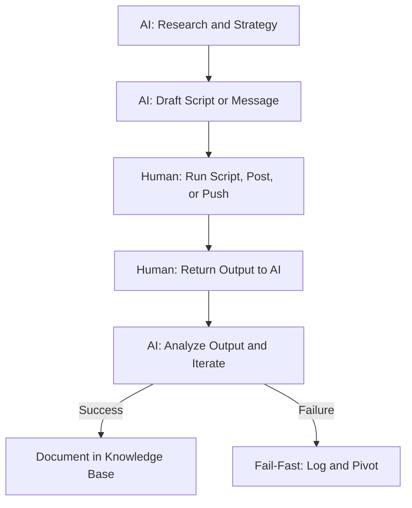

# Crypto Puzzle Lab

A systematic research lab for analyzing and solving complex cryptocurrency puzzles using blockchain forensics, OSINT, and semantic anomaly detection.

## Mission

To methodically document, analyze, and attempt resolution of high-value crypto puzzles through:
- **On-chain forensics**: wallet analysis, transaction tracing, artifact examination
- **Semantic analysis**: identifying planted words and hidden patterns in puzzle sources
- **BIP39 wordlist matching**: cross-referencing puzzle text against the 2048-word seed phrase list
- **Community intelligence**: tracking solver progress and author communications

## Operating Loop



## Active Investigations

### 1. Guntis Vitolins: 10 ETH Challenge (Primary Focus)
- **Challenge**: 10 ETH; current wallet balance: 8.61 ETH (~$21,052)
- **Target**: `0x9C2F44EFAd0c1E852a09dF9939e6DaF061140CaF`
- **Type**: BIP39 seed phrase (12 words) hidden in video + blog post
- **Status**: Open (puzzle still live as of 2026-08-24)
- **Our Progress**: Three positions and two additional list members are externally confirmed; the complete candidate pool remains open

### 2. BLM Collage: Welcome to the Brave New World
- **Prize**: 20,107,284 sats (~$12,668)
- **Type**: Image steganography, word selection, BIP39 seed, text cipher
- **Status**: Open
- **Our Progress**: Foothold established via issue #12 in floflo777's repo

### 3. GSMG.io 5 BTC Puzzle
- **Prize**: Originally 5 BTC (now reportedly reduced to 1.5 BTC)
- **Type**: Text cipher, pixel code, web tree, raw private key
- **Status**: Open (degraded to speculative)
- **Our Progress**: Pipeline documented

### 4. 0.2 BTC Full Analysis
- **Prize**: 0.2 BTC
- **Type**: Multi-stage cryptographic challenge
- **Status**: Documented

## Repository Structure

crypto-puzzle-lab/
├── README.md
├── LICENSE
├── CONTRIBUTING.md
├── SECURITY.md
├── docs/       # Puzzle analyses, research logs, protocols, and roadmap
├── scripts/    # Reproducible analysis, verification, and attack scripts
├── knowledge_base/ # Machine-readable research outputs
├── patterns/   # Documented vulnerability and exploit signature patterns
├── cases/      # Individual incident write-ups referencing the patterns above
└── tools/      # Scaffolding for pattern matching and protocol scanning scripts

Start with these documents:

- [Puzzle index](docs/PUZZLE_INDEX.md) - overview of tracked puzzles and status
- [Latest intelligence log](docs/INTEL_LOG_ADDITIONS_2026-08-24.md) - findings [18]-[30]
- [Guntis full analysis](docs/10ETH_GUNTIS_FULL_ANALYSIS.md) - complete ETH puzzle analysis
- [BLM image analysis](docs/BLM_IMAGE_READING.md) - image-reading results and retractions
- [GSMG pipeline](docs/GSMG_PIPELINE.md) - documented GSMG solving pipeline
- [Research methodology](docs/RESEARCH_METHODOLOGY.md) - evidence and validation rules
- [Technical references](docs/TECHNICAL_REFERENCES.md) - official BIP-39 and BIP-44 references
- [Hybrid protocol](docs/HYBRID_PROTOCOL.md) - AI/human operating protocol
- [Contributing guide](CONTRIBUTING.md) - collaboration and evidence rules
- [Security policy](SECURITY.md) - responsible disclosure guidance

## Security Pattern Research

Alongside the puzzle-solving research, this repository tracks recurring DeFi and wallet-security exploit patterns, documents individual incidents against those patterns, and scaffolds tooling to spot the same signature before it is exploited again.

- `patterns/` - documented vulnerability classes (for example oracle manipulation, address poisoning, LP reserve manipulation), each with the code or on-chain signature that identifies it
- `cases/` - dated incident write-ups that reference the matching pattern; entries are labeled with their verification status and should be cross-checked on-chain before being treated as confirmed
- `tools/` - Python scaffolding for automated pattern matching, pre-emptive protocol scanning, and cross-chain fund tracking; these are early scaffolds and are not yet wired to live data sources

See [patterns/oracle-manipulation/spot-price-vulnerability.md](patterns/oracle-manipulation/spot-price-vulnerability.md) and [cases/moonwell-2026-08.md](cases/moonwell-2026-08.md) for the current example.

## Key Findings (Guntis 10 ETH Challenge)

### Confirmed Anchors
| Position | Word | Source |
|----------|------|--------|
| 1 | dutch | Hint 2: Netherlands |
| 5 | fog | Hint 3: Water droplets; upstream archive correction |
| 12 | parrot | Hint 1: Tropical bird |
| Free | fiber | Hint 4: Plant-based food |
| Free | fork | Hint 5: Keyboard fork |

### Candidate Pool (current working set)
`sponsor`, `donor`, `token`, `card`, `link`, `planet`, `board`, `cat`, `ill`, `hen`, `cause`, `use`

### Critical Technical Facts
- **MetaMask 2020 Path**: `m/44'/60'/0'/0/0` (verified)
- **Search Space**: ~287.4M candidate lists
- **Estimated Runtime**: ~3 hours on laptop CPU
- **Witness Protocol**: 2 planted candidates for validation

### External Cross-Check (2026-08-26)

The upstream [open-crypto-puzzles Guntis dossier](https://github.com/floflo777/open-crypto-puzzles/tree/main/1-big-prizes/guntis-vitolins-metamask-8-6eth) reports approximately 16.75 billion candidate derivations tested across witnessed sweeps, with no match. Its merged archive correction resolves position 5 to `fog` and drops `cloud`; an additional open PR proposes a connecting-word sweep of 18.66 billion derivations, also with no match. Treat the PR result as pending upstream review and re-verify the ledger before treating it as final.

## Methodology

### 7-Layer OSINT Stack
1. Primary source (blog, video, transcript)
2. Archive raw (Wayback Machine `id_` extraction)
3. Platform metadata (og tags, meta keywords)
4. Community (issues, PRs, threads)
5. On-chain (funding, drains, ENS, dust)
6. Author identity (handles, repos, cross-posts)
7. Tooling landscape (other solvers' engines)

### Evidence Labeling Protocol (Rule #19)
Every claim is labeled:
- **STATED**: Direct quote from primary source
- **OBSERVED**: Fact verified through examination
- **INFERRED**: Logical deduction from evidence
- **UNVERIFIED**: Claim without sufficient evidence

### Witness-Before-Negative (Rule #20)
No negative result is accepted unless 2 known-valid candidates are successfully recovered during the same sweep.

## Running the Analysis

### Prerequisites
```bash
pip install -r requirements.txt
```

### Execution
```bash
cd scripts
python run6_tiers.py
```
Expected output includes a witness check before the main search:

```text
[WITNESS] planted: ... (2 lines)
[PROGRESS] X.XM / 287.4M lists (every minute)
[DONE] tested=... valid=... (after ~3 hours)
Either !!! HIT !!! or [RESULT] Tier-S negative (witnessed)
```

### On-chain forensics scripts

```bash
python ens_forensics.py    # Wallet analysis
python hex_decoder.py      # Transaction payload analysis
python artifact_hunter.py  # Token/NFT artifact analysis
```

For the complete research rules, see [HYBRID_PROTOCOL.md](docs/HYBRID_PROTOCOL.md). Key principles:
Rule #13: Hardware strategy (phone vs laptop)
Rule #14: Pre-execution code validation
Rule #15: Documentation protocol (English only)
Rule #17: Laptop TODO list protocol
Rule #19: Evidence labeling (STATED/OBSERVED/INFERRED/UNVERIFIED)
Rule #20: Witness-before-negative
Rule #21: Race protocol (instant sweep on hit)

## Disclaimer

This repository is for educational and research purposes only. All puzzle solutions are derived through publicly available information and blockchain analysis. No unauthorized access or malicious activity is conducted.

## Acknowledgments

Research conducted in collaboration with AI assistants using systematic fact-checking and evidence labeling protocols.

Last updated: 2026-08-29

Status: Active research - Guntis 10 ETH challenge execution pending


