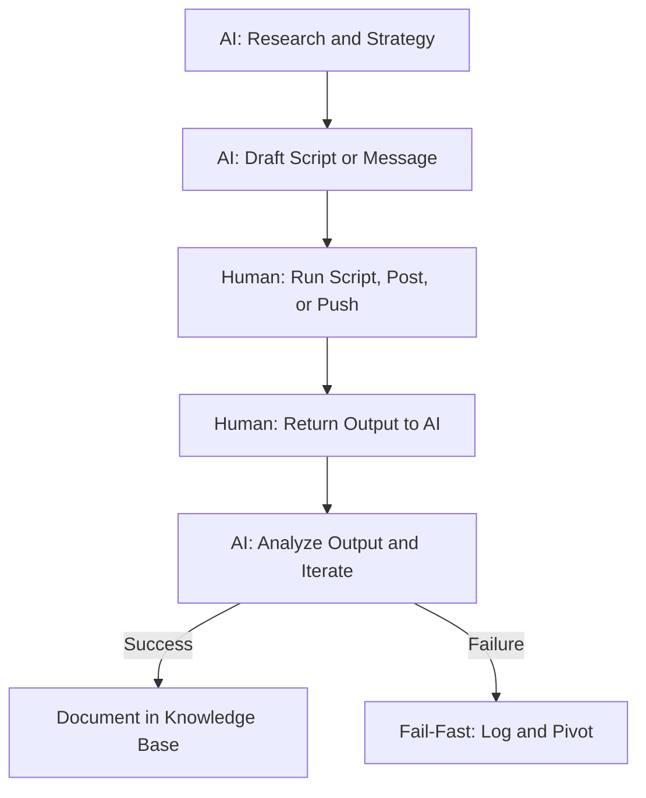

# crypto-puzzle-lab

Forensic on-chain research · Security pattern detection · Bounty hunting

**Last updated:** August 29, 2026

## About this lab

This is a forensic research lab focused on:
- **Crypto puzzle solving** (BLM, Guntis, etc.)
- **Security pattern detection** (oracle manipulation, address poisoning, rug pulls)
- **Cross-chain wallet tracking**
- **KYC-leak attribution** via funding chain analysis
- **Bounty hunting** for white-hat disclosure
- **Live RPC forensics** via Solana/Ethereum mainnet JSON-RPC (snapshot-accurate data)

We track the wallets, not the narratives.

## Operating Loop



## Active Investigations

### 🔴 Active: $GOLD rug pull (Aug 29, 2026)
- **Incident:** 224.5M $GOLD dumped for 3,178 SOL ($330K)
- **Finding:** Two KYC leaks identified
  - Creator wallet funded by KuCoin Hot Wallet
  - 15 cluster wallets funded by Binance-labeled wallet (00:17 UTC)
- **Status:** Monitoring exit wallet H6BHT5...HWEZ (2,316 SOL)
- **Action:** Published T1-T6 thread with sniper replies under Lookonchain
- **Details:** [cases/gold-rug-2026-08.md](cases/gold-rug-2026-08.md), [patterns/rug-pull/supply-control-signature.md](patterns/rug-pull/supply-control-signature.md)

### 🔴 Active: Moonwell oracle exploit (Aug 27, 2026)
- **Incident:** $8.7M loss via spot-price manipulation
- **Finding:** Same pattern as 2 previous Base exploits
- **Status:** Pattern signature documented, hunting next target
- **Details:** [patterns/oracle-manipulation/spot-price-vulnerability.md](patterns/oracle-manipulation/spot-price-vulnerability.md), [cases/moonwell-2026-08.md](cases/moonwell-2026-08.md)

### 🟡 Monitoring: $870K address poisoning
- **Incident:** Wallet drained via dust-gas attack
- **Finding:** Funding via Bitfinex (Dec 2024) + Mercuryo (Jun 2025)
- **Status:** KYC leak identified, waiting for movement
- **Details:** [cases/address-poisoning-2026.md](cases/address-poisoning-2026.md), [patterns/address-poisoning/dust-drop-activation.md](patterns/address-poisoning/dust-drop-activation.md)

### 🟡 Monitoring: Whale repeat victim
- **Incident:** Same wallet hacked twice ($24M in 2023, $25.6M in 2026)
- **Finding:** Non-freezable DAI exit pattern
- **Status:** Business model documented; case write-up pending

## Repository Structure

crypto-puzzle-lab/
├── README.md
├── LICENSE
├── CONTRIBUTING.md
├── SECURITY.md
├── docs/       # Puzzle analyses, research logs, protocols, and roadmap
│   └── methodology.md              # Security research methodology & evidence rules
├── scripts/    # Reproducible analysis, verification, and attack scripts
├── knowledge_base/ # Machine-readable research outputs
├── patterns/   # Documented vulnerability and exploit signature patterns
│   ├── oracle-manipulation/spot-price-vulnerability.md
│   ├── address-poisoning/dust-drop-activation.md
│   └── rug-pull/supply-control-signature.md
├── cases/      # Individual incident write-ups referencing the patterns above
│   ├── moonwell-2026-08.md
│   ├── gold-rug-2026-08.md
│   └── address-poisoning-2026.md
└── tools/      # Scaffolding for pattern matching and protocol scanning scripts

Start with these documents:

- [Puzzle index](docs/PUZZLE_INDEX.md) - overview of tracked puzzles and status
- [Latest intelligence log](docs/INTEL_LOG_ADDITIONS_2026-08-24.md) - findings [18]-[30]
- [Guntis full analysis](docs/10ETH_GUNTIS_FULL_ANALYSIS.md) - complete ETH puzzle analysis
- [BLM image analysis](docs/BLM_IMAGE_READING.md) - image-reading results and retractions
- [GSMG pipeline](docs/GSMG_PIPELINE.md) - documented GSMG solving pipeline
- [Research methodology](docs/RESEARCH_METHODOLOGY.md) - evidence and validation rules
- [Security research methodology](docs/methodology.md) - evidence rules and investigation workflow for security cases
- [Technical references](docs/TECHNICAL_REFERENCES.md) - official BIP-39 and BIP-44 references
- [Hybrid protocol](docs/HYBRID_PROTOCOL.md) - AI/human operating protocol
- [Contributing guide](CONTRIBUTING.md) - collaboration and evidence rules
- [Security policy](SECURITY.md) - responsible disclosure guidance

## Tools

### Working tools

#### [movie_enigma_combo_generator.py](scripts/movie_enigma_combo_generator.py)
Generate order-preserving 24-word subsets from a 34-word list, filtered by BIP39 checksum validity. Tested: filters non-BIP39 words (goon/shark), computes ~41K valid candidates from ~10.5M combinations.

**Usage:**
```bash
python scripts/movie_enigma_combo_generator.py [words_file] [-o candidates.txt]
```

#### [make_pdf_report.py](scripts/make_pdf_report.py)
Dependency-free minimal PDF writer for audit reports. Tested: produces valid `%PDF-1.4` output.

**Usage:**
```bash
python scripts/make_pdf_report.py [input.txt] [-o report.pdf]
```

### Scaffold tools (not yet wired to live data)

### [pattern-matcher.py](tools/pattern-matcher.py)
Match known attack signatures against new on-chain activity. Output: probable pattern + confidence score.

### [pattern_detector.py](tools/pattern_detector.py)
Analyze funding chains to identify cluster wallets. Detects:
- Identical dust drops (±0.055 SOL)
- Shared activation wallets
- Supply control percentages

### [cross_chain_tracker.py](tools/cross_chain_tracker.py)
Trace wallet movements across multiple chains (ETH, BSC, Solana, Base). Identifies:
- Bridge hops
- CEX deposits
- Mixer interactions

### [pre-emptive-hunter.py](tools/pre-emptive-hunter.py)
Predict next target based on:
- Recent pattern matches
- Liquidity concentration
- Time since last attack

### [bounty_hunter.py](tools/bounty_hunter.py)
Scan protocol repositories for:
- White-hat bounty programs
- Open security issues
- Undisclosed vulnerability reports

All five scaffold tools above are early scaffolds: the core logic is defined, but they are not yet wired to live blockchain data sources.

## Evidence Labeling Protocol (Security Cases)

All claims in `cases/` and `patterns/` are labeled:

- **OBSERVED** - Direct from blockchain data (Etherscan, Solscan, RPC)
- **INFERRED** - Logically derived with high confidence
- **UNVERIFIED** - Claim that needs confirmation
- **DISPROVEN** - Falsified by counter-evidence

This extends the puzzle-research evidence rules in [docs/RESEARCH_METHODOLOGY.md](docs/RESEARCH_METHODOLOGY.md). The dedicated security-case protocol, workflow, and ethical guidelines live in [docs/methodology.md](docs/methodology.md).

## Operational Capabilities

### Live monitoring
- Cielo Finance alerts on 4 critical wallets ($GOLD cluster)
- Real-time movement triggers -> T7-update published within minutes

### Distributed intelligence
- AI drafts threads, scripts, and forensic reports
- Human executes on-chain queries, posts, and commits
- AI analyzes results and iterates
- Output: documented in knowledge_base/ or published on X

### Sniper-reply playbook
- Targeted forensic replies under Tier-1 investigators (Lookonchain, PeckShieldAlert, ZachXBT)
- Peer-to-peer engagement; never DM-pressure
- Value-first: actionable intelligence, not promotion

## Active Crypto Puzzles

### BLM Collage (Welcome to the Brave New World)
- **Status:** Investigation active
- **Progress:** 60%
- **Focus:** Cross-chain exit tracing
- **Details:** [docs/BLM_IMAGE_READING.md](docs/BLM_IMAGE_READING.md), [docs/0.2_BTC_FULL_ANALYSIS.md](docs/0.2_BTC_FULL_ANALYSIS.md)

### Guntis puzzle
- **Status:** Waiting for new hint
- **Progress:** 40%
- **Focus:** Smart contract reverse engineering
- **Details:** [docs/10ETH_GUNTIS_FULL_ANALYSIS.md](docs/10ETH_GUNTIS_FULL_ANALYSIS.md)

### Bitcoin Movie Enigma
- **Status:** Run 1 pending
- **Progress:** 15%
- **Focus:** 34-still -> 24-word BIP39 seed puzzle; list audit complete (goon/shark errors)
- **Details:** [docs/BITCOIN_MOVIE_ENIGMA.md](docs/BITCOIN_MOVIE_ENIGMA.md)

See [docs/PUZZLE_INDEX.md](docs/PUZZLE_INDEX.md) for the full puzzle list, including GSMG.io and the 0.2 BTC analysis.

## Technical References

- **Oracle manipulation:** [docs/TECHNICAL_REFERENCES.md](docs/TECHNICAL_REFERENCES.md#price-feed-vulnerabilities) - see the "Price Feed Vulnerabilities" section
- **Address poisoning:** [patterns/address-poisoning/dust-drop-activation.md](patterns/address-poisoning/dust-drop-activation.md) - dust-drop activation signature and detection heuristics
- **KYC attribution:** [cases/address-poisoning-2026.md](cases/address-poisoning-2026.md) - funding-chain attribution and dual KYC leak

## Key Findings (Guntis 10 ETH Challenge)

### Confirmed Anchors
| Position | Word | Source |
|----------|------|--------|
| 1 | dutch | Hint 2: Netherlands |
| 5 | fog | Hint 3: Water droplets; upstream archive correction |
| 12 | parrot | Hint 1: Tropical bird |
| Free | fiber | Hint 4: Plant-based food |
| Free | fork | Hint 5: Keyboard fork |

### Candidate Pool (current working set)
`sponsor`, `donor`, `token`, `card`, `link`, `planet`, `board`, `cat`, `ill`, `hen`, `cause`, `use`

### Critical Technical Facts
- **MetaMask 2020 Path**: `m/44'/60'/0'/0/0` (verified)
- **Search Space**: ~287.4M candidate lists
- **Estimated Runtime**: ~3 hours on laptop CPU
- **Witness Protocol**: 2 planted candidates for validation

### External Cross-Check (2026-08-26)

The upstream [open-crypto-puzzles Guntis dossier](https://github.com/floflo777/open-crypto-puzzles/tree/main/1-big-prizes/guntis-vitolins-metamask-8-6eth) reports approximately 16.75 billion candidate derivations tested across witnessed sweeps, with no match. Its merged archive correction resolves position 5 to `fog` and drops `cloud`; an additional open PR proposes a connecting-word sweep of 18.66 billion derivations, also with no match. Treat the PR result as pending upstream review and re-verify the ledger before treating it as final.

## Methodology

### 7-Layer OSINT Stack
1. Primary source (blog, video, transcript)
2. Archive raw (Wayback Machine `id_` extraction)
3. Platform metadata (og tags, meta keywords)
4. Community (issues, PRs, threads)
5. On-chain (funding, drains, ENS, dust)
6. Author identity (handles, repos, cross-posts)
7. Tooling landscape (other solvers' engines)

### Evidence Labeling Protocol (Rule #19)
Every claim is labeled:
- **STATED**: Direct quote from primary source
- **OBSERVED**: Fact verified through examination
- **INFERRED**: Logical deduction from evidence
- **UNVERIFIED**: Claim without sufficient evidence

### Witness-Before-Negative (Rule #20)
No negative result is accepted unless 2 known-valid candidates are successfully recovered during the same sweep.

## Running the Analysis

### Prerequisites
```bash
pip install -r requirements.txt
```

### Execution
```bash
cd scripts
python run6_tiers.py
```
Expected output includes a witness check before the main search:

```text
[WITNESS] planted: ... (2 lines)
[PROGRESS] X.XM / 287.4M lists (every minute)
[DONE] tested=... valid=... (after ~3 hours)
Either !!! HIT !!! or [RESULT] Tier-S negative (witnessed)
```

### On-chain forensics scripts

```bash
python ens_forensics.py    # Wallet analysis
python hex_decoder.py      # Transaction payload analysis
python artifact_hunter.py  # Token/NFT artifact analysis
```

For the complete research rules, see [HYBRID_PROTOCOL.md](docs/HYBRID_PROTOCOL.md). Key principles:
Rule #13: Hardware strategy (phone vs laptop)
Rule #14: Pre-execution code validation
Rule #15: Documentation protocol (English only)
Rule #17: Laptop TODO list protocol
Rule #19: Evidence labeling (STATED/OBSERVED/INFERRED/UNVERIFIED)
Rule #20: Witness-before-negative
Rule #21: Race protocol (instant sweep on hit)

## Disclaimer

This repository is for educational and research purposes only. Puzzle solutions and security-pattern findings are derived from publicly available information and blockchain analysis. No unauthorized access or malicious activity is conducted.

## Acknowledgments

Research conducted in collaboration with AI assistants using systematic fact-checking and evidence labeling protocols.

## Contact

**X:** [@sprunky_eth](https://x.com/sprunky_eth)

## License

This repository is licensed under [MIT](LICENSE). Tools and research here are for research and responsible-disclosure purposes only; do not use them for malicious purposes.


